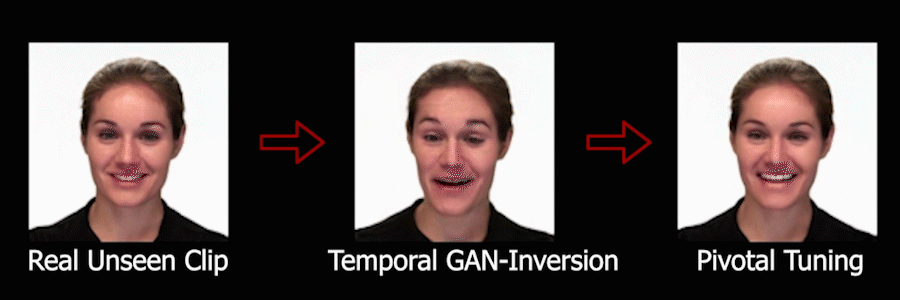

# One Style is All You Need to Generate a Video

### [Project Page](https://sandman002.github.io/CTSVG/) | [arXiv](https://arxiv.org/abs/2310.17835) | [Video](https://youtu.be/bsMazroFH6k)

This is the official pytorch implementation of our paper accepted in WACV 2024.
## Changing emotion mid sequence


## Temporal GAN Inversion and Pivotal Tuning



## Temporal GAN Inversion to Reenactment


## Requirements
- Ubuntu 20.04.3 LTS (GNU/Linux 5.4.0-91-generic x86_64)
- CUDA Version: 11.5
- Python>=3.8

## Environment Setup

```
conda create -n CTSVG python=3.8
conda activate CTSVG

pip install torch==1.7.1+cu110 torchvision==0.8.2+cu110 torchaudio===0.7.2 -f https://download.pytorch.org/whl/torch_stable.html
pip install opencv-python tqdm pandas
pip install scikit-image==0.19.3 ipython
```
The last two packages are required by projector.py for GAN-Inversion. 
Checkout the requirements.yml file to see the complete list of python packages with which the project scripts were last tested successfully.
## Dataset

### Structure
Following is the directory structure for MEAD dataset.
```
MEAD
|-- M003_front
    |-- angry
        |-- level_1
            |-- 001
                |-- frame0000.jpg
                |-- frame0001.jpg
                |-- ...
            |-- 002
            |-- 003
            |-- ...
        |-- level_2
        |-- level_3
    |-- contempt
    |-- disgusted
    |-- fear
    |-- happy
    |-- neutral
    |-- sad
    |-- surprised
|-- M007_front
|-- W019_front
|-- ...
```
Following is the directory structure for UTD-MHAD dataset.
```
UTD-MHAD
|-- train
    |-- a1
        |-- a1_s2_t1_color
            |-- frame0000.jpg
            |-- frame0001.jpg
            |-- ...
        |-- a1_s2_t2_color
            |-- frame0000.jpg
            |-- frame0001.jpg
            |-- ...
        |-- ...
    |-- a2
    |-- ...
    |-- a27
|-- val
    |-- a1_s1_t1_color
        |-- frame0000.jpg
        |-- frame0001.jpg
        |-- ...
    |-- a1_s1_t2_color
    |-- ...
```
Following is the directory structure for RAVDESS dataset.
```
RAVDESS
|-- Actor_01
    |-- 02-01-01-01-01-01-01
        |-- frame0000.jpg
        |-- frame0001.jpg
        |-- ...
    |-- 02-01-01-01-01-02-01
    |-- 02-01-07-01-02-01-01
    |-- ...
|-- Actor_02
|-- Actor_03
|-- Actor_04
|-- ...     
```

### Dataset download
[MEAD](https://wywu.github.io/projects/MEAD/MEAD.html) | [RAVDESS](https://www.kaggle.com/datasets/uwrfkaggler/ravdess-emotional-speech-audio) | [UTD-MHAD](https://personal.utdallas.edu/~kehtar/UTD-MHAD.html)

### Checkpoints
| Dataset | frame resolution    | latent dim| t2v components | training iterations | links |
| :---:   | :---: 	| :---: 	|   :---: 	     |:---: 	           |:---:  |
| MEAD    |   256x256  	|    256   	|   128          |     120k            |[external zenodo link](https://zenodo.org/record/7930268/files/mead_sz256_latent256_dyn128_120k.pt?download=1)      |
| MEAD    |   128x128  	|    256   	|   128          |     117k            |[external zenodo link](https://zenodo.org/record/7930268/files/mead_sz128_latent256_dyn128_117k.pt?download=1)      |
| MEAD    |   128x128  	|    128   	|   64           |     120k            |[external zenodo link](https://zenodo.org/record/7930268/files/mead_sz128_latent128_dyn64_120k.pt?download=1)       |   
| RAVDESS |   128x128  	|    128   	|   64           |     120k            |[external zenodo link](https://zenodo.org/record/7930268/files/RAVDESS_sz128_latent128_dyn64_120kv.pt?download=1)   | 
## Training
```
python train.py --chkpath ./ckpt/ --samplepath ./sample/ --batch 16 --size 128 --dyn_size 256 --latent 320 --traindata_csv ./datasets/mead_train.csv

```
Resume training

Choose the checkpoint file using --ckpt switch
```
python train.py --ckpt ./ckpt/XXXXX.pt --chkpath ./ckpt/ --samplepath ./sample/ --batch 16 --size 128 --dyn_size 256 --latent 320 --traindata_csv ./datasets/mead_train.csv
```
## Generate (Inference)
```
python generate.py --ckpt ./ckpt/XXXXX.pt --savepath ./sample/ --num_classes 8 --num_person 30 --frames 120 --latent 256 --dyn_size 128 --personlist 19 20 1 --actlist 0 3 1
```
## Temporal GAN Inversion
```
python projector.py ./ckpt/XXXXX.pt --step 200 --nframes 60 --num_person 30 --num_classes 8 --maindir ./inp/ --outputdir ./output/ --latent 256 --dyn_size 128 --re_person 7 --re_label 4 
```
## Acknowledgement
The coding pipeline has been burrowed from
https://github.com/rosinality/stylegan2-pytorch .
Please refer to https://github.com/NVlabs/stylegan2 for CUDA kernel licensing,
and https://github.com/richzhang/PerceptualSimilarity for LPIPS package.

The benchmarking on action classification was done using [PoseC3D](https://arxiv.org/abs/2104.13586) implemented in https://github.com/open-mmlab .

### Citation
```
@inproceedings{
  title = {One Style is All You Need to Generate a Video},
  author = {Sandeep Manandhar and Auguste Genovesio},
  booktitle = {Proceedings of the {Winter Conference on Applications of Computer Vision (WACV)}},
  year = {2024},
}
```
